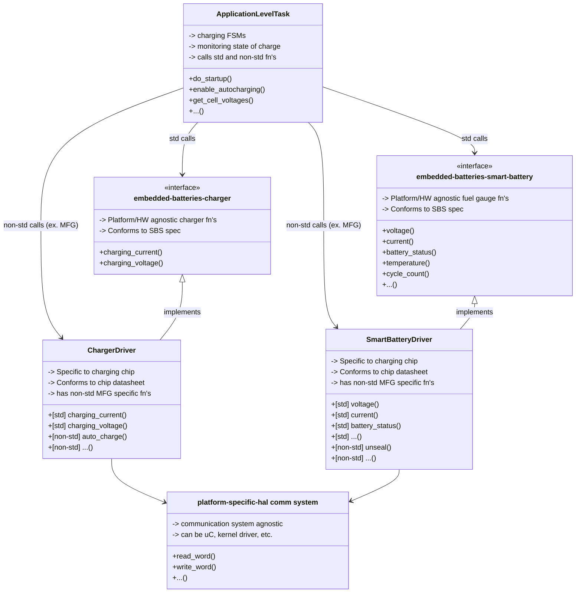

# s0747.github.io

## Design Principles
### Generic Design Diagram

```mermaid
    classDiagram
        Application Level Task --> ChargerDriver: non-std calls (ex. MFG)
        Application Level Task --> SmartBatteryDriver: non-std calls (ex. MFG)
        Application Level Task: -> charging FSMs
        Application Level Task: -> monitoring state of charge
        Application Level Task: -> calls std and non-std fn's
        Application Level Task: +do_startup()
        Application Level Task: +enable_autocharging()
        Application Level Task: +get_cell_voltages()
        Application Level Task: +...()
        Application Level Task --> embedded-batteries-charger: std calls
        Application Level Task --> embedded-batteries-smart-battery: std calls
        embedded-batteries-smart-battery <|-- SmartBatteryDriver: implements
        embedded-batteries-charger <|-- ChargerDriver: implements
        embedded-batteries-charger: -> Platform/HW agnostic charger fn's
        embedded-batteries-charger: -> Conforms to SBS spec
        embedded-batteries-charger: +charging_current()
        embedded-batteries-charger: +charging_voltage()
        embedded-batteries-smart-battery: -> Platform/HW agnostic fuel gauge fn's
        embedded-batteries-smart-battery: -> Conforms to SBS spec
        embedded-batteries-smart-battery: +voltage()
        embedded-batteries-smart-battery: +current()
        embedded-batteries-smart-battery: +battery_status()
        embedded-batteries-smart-battery: +temperature()
        embedded-batteries-smart-battery: +cycle_count()
        embedded-batteries-smart-battery: +...()
        <<interface>> embedded-batteries-charger
        <<interface>> embedded-batteries-smart-battery
        ChargerDriver --> platform-specific-hal
        ChargerDriver: -> Specific to charging chip
        ChargerDriver: -> Conforms to chip datasheet
        ChargerDriver: -> has non-std MFG specific fn's
        ChargerDriver: +[std] charging_current()
        ChargerDriver: +[std] charging_voltage()
        ChargerDriver: +[non-std] auto_charge()
        ChargerDriver: +[non-std] ...()
        SmartBatteryDriver --> platform-specific-hal
        SmartBatteryDriver: -> Specific to charging chip
        SmartBatteryDriver: -> Conforms to chip datasheet
        SmartBatteryDriver: -> has non-std MFG specific fn's
        SmartBatteryDriver: +[std] voltage()
        SmartBatteryDriver: +[std] current()
        SmartBatteryDriver: +[std] battery_status()
        SmartBatteryDriver: +[std] ...()
        SmartBatteryDriver: +[non-std] unseal()
        SmartBatteryDriver: +[non-std] ...()
        class platform-specific-hal["platform-specific-hal comm system"]
        platform-specific-hal: -> communication system agnostic
        platform-specific-hal: -> can be uC, kernel driver, etc.
        platform-specific-hal: +read_word()
        platform-specific-hal: +write_word()
        platform-specific-hal: +...()
```
